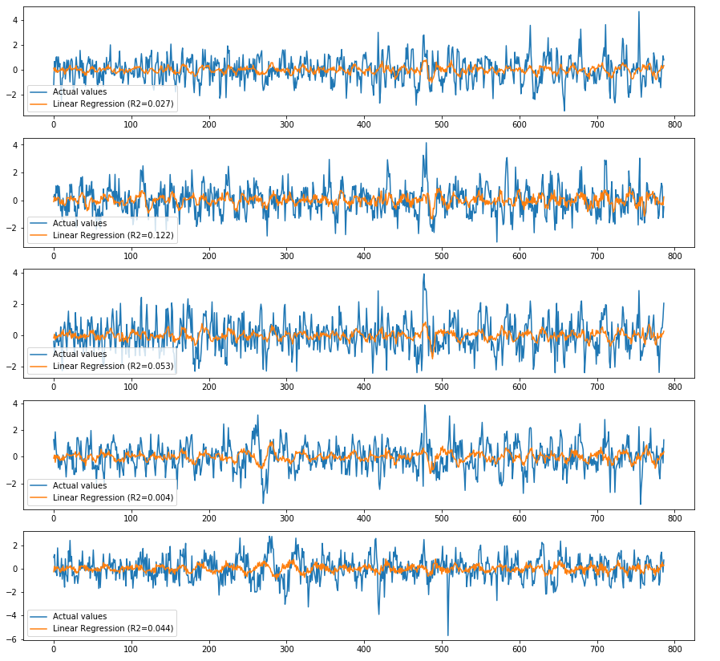

# 3D Visualization of fMRI time series

Team contributors: François Paugam & anyone interested

## Summary 

I am interested in developping some 3D viewing tools for fMRI time series data, but I am open to adapt this idea to fit an other project.

## Project definition 

### Background

I am a computer science PhD student at Université de Montréal and have already some experience with python and in deep learning. I am mainly working with fMRI BOLD time series, and spend a lot of time manipulating this kind of 4D data, so having a cool looking visualizer would be certainly a great feature.

### Goal

Turning this:

into something like this:

### Tools 

I am thinking of using the d3 javascript library for visualization. But it might be easier to leverage from existing visualization tools, suvh as nilearn ones, so identifying and using their techno should be the starting point.

### Data 

fMRI time series data, any kind of volumetric measures such as BOLD signals.

### Deliverables

The idea is to have an interactive 3D plotter usable with a web interface such as jupyter notebooks. Ideally if all goes well it could end up with a pull request to nilearn.

## Results 

### Progress overview

Definitive subject to be precised, tools to be identified, teamates to be found.

### Tools I learned during this project

Planning on learning d3.js or whatever existing plotters are built on.
 
### Results 

#### Deliverable 1: 

#### Deliverable 2: 

 
 
## Conclusion and acknowledgement

BHS is great !
